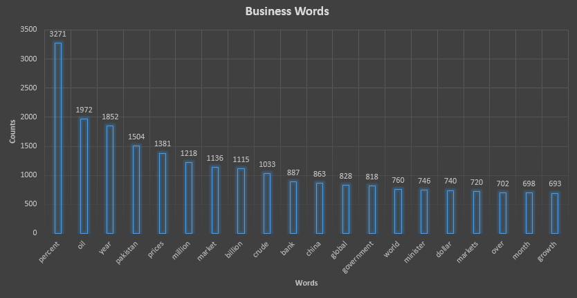
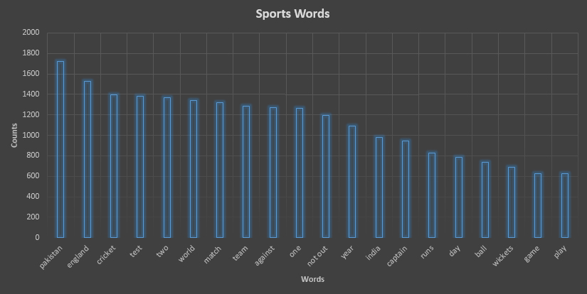

# Articles-Analysis
Predictive analysis on the dataset taken from https://www.kaggle.com/asad1m9a9h6mood/news-articles. It has news articles from 2015 till 2018, related to business and sports.
Aim of this project was to compare the performance of different machine learning methods and so I used the simple bag-of-words approach for classification. 

First, I did some word analysis on the different News Types. There are two News Types in this dataset i.e., Business and Sports. Following are the top 20 words with respect to frequency along with their number of occurences.

 

 

Intersection of these two sets contains very less words so intuitively classification accuracies are expected to be high.
Following are the models we use for comparison 
1) K Nearest Neighbors [(KNN)](https://scikit-learn.org/stable/modules/generated/sklearn.neighbors.KNeighborsClassifier.html)
2) Logistic Regression [(LR)](https://scikit-learn.org/stable/modules/generated/sklearn.linear_model.LogisticRegression.html)
3) Forward-Feed Neural Networks [(FNN)](https://scikit-learn.org/stable/modules/neural_networks_supervised.html)
4) Multinomial Naive Bayes [(MNB)](https://scikit-learn.org/stable/modules/generated/sklearn.naive_bayes.MultinomialNB.html)

I used the 80-20 train test split. Following are the accuracies for different models on the 20% test set.

| Classifier | Accuracy  |
|------------|---------- |
| KNN (k=3)  | 93.88%    |
| LR         | 99.26%    |
| FNN        | 99.07%    |
| MNB        | **99.63%**|

As evident from the table, the best performing model among these is Multinomial Naive Bayes.